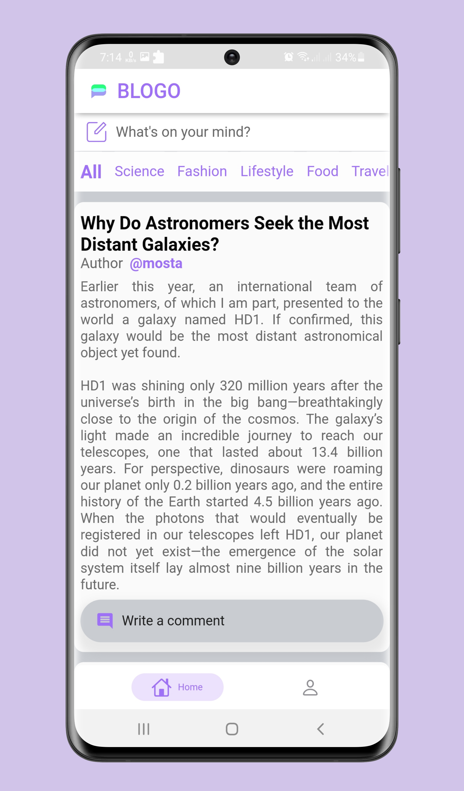
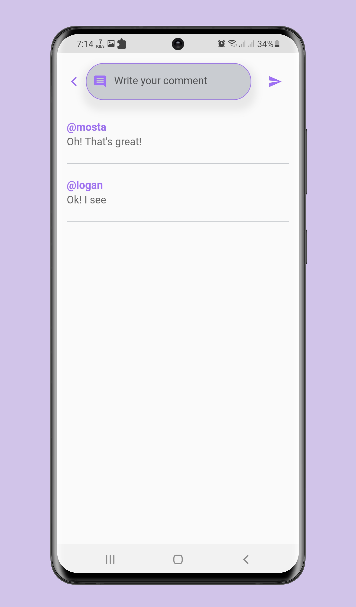

# Introduction

> "Blogo App"

It's a flutter app with integration of RestfulAPI. In this app user can post his blog, and comment other's blog.

## :bulb: Key Features (or What will you learn, if you are here to learn)

- [x] Auth system
- [x] RestfulAPI Integration
- [x] GetX State Management

## 🚀 &nbsp;Installation

To clone and run this application, you'll need [Git](https://git-scm.com) and [Flutter](https://flutter.dev/docs/get-started/install) installed on your computer. From your command line:

```bash
# Clone this repository
$ git clone https://github.com/mostafijur566/blog_app_flutter.git

# Go into the repository
$ cd blog_app_flutter

# Install dependencies
$ flutter pub get

# Run the app
$ flutter run

# You can also run this app on Web (Not Optimized and Flutter Beta or Above Channel Required)
$ flutter run -d chrome
```

### Packages

Below are the information about packages used in this project.

| Package                                                                          |
| -------------------------------------------------------------------------------- | 
| [persistent_bottom_nav_bar](https://pub.dev/packages/persistent_bottom_nav_bar)  |
| [get](https://pub.dev/packages/get)                                              |
| [shared_preferences](https://pub.dev/packages/shared_preferences)                |
| [flutter_spinkit](https://pub.dev/packages/flutter_spinkit)                      |
| [snippet_coder_utils](https://pub.dev/packages/snippet_coder_utils)              |

### API Used

`https://github.com/mostafijur566/blog_app_system`

### Directory Structure

The project directory structure is as follows:

```
├── android
├── assets
├── build
├── ios
├── lib
    ├── controller
    ├── data
    ├── helper
    ├── models
    ├── pages
    ├── routes
    ├── utils
    ├── widgets
    ├── main.dart
├── pubspec.lock
├── pubspec.yaml

```

## :heart: Contributor

Made by [Mostafijur Rahman](https://github.com/mostafijur566)

## :camera_flash: Screenshots

   
      
   

